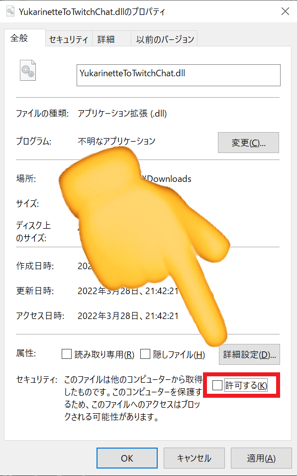
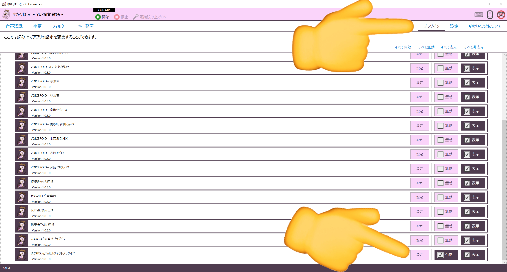
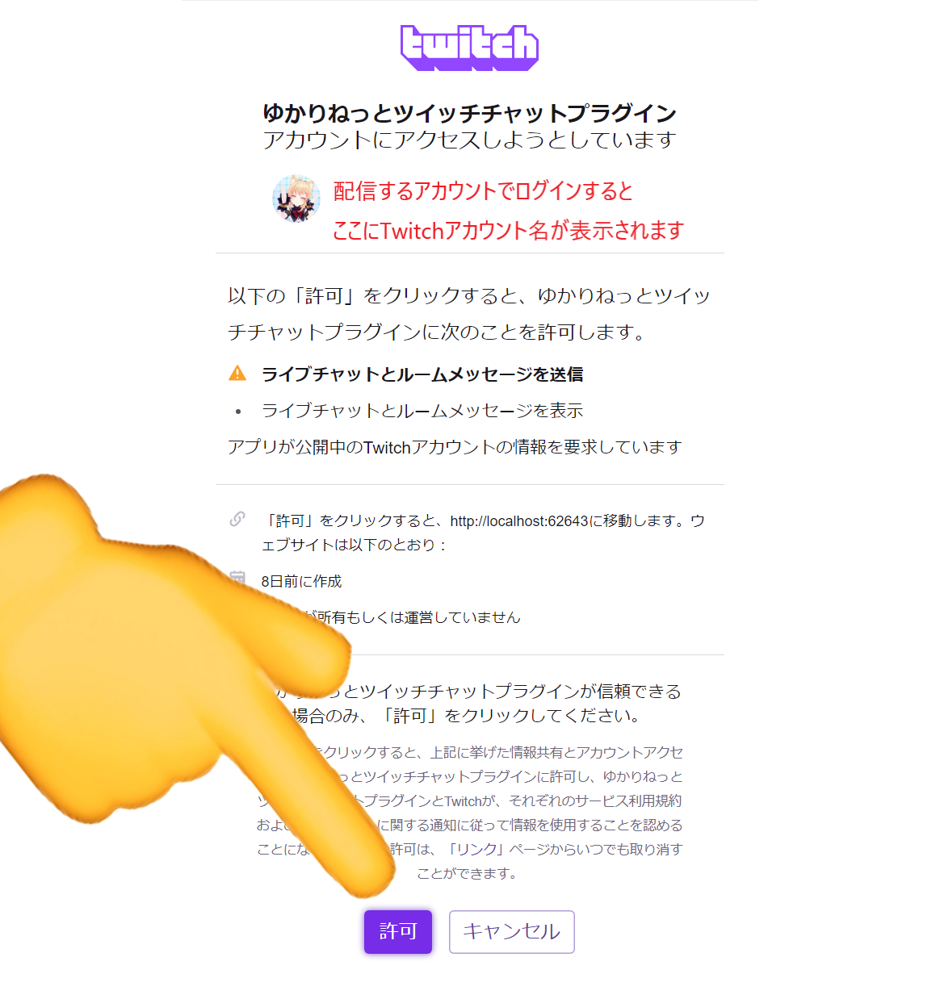

# YukarinetteToTwitchChat

ゆかりねっとの音声認識結果を**自分の** Twitch チャンネルのチャットに投稿するプラグインです。

# 使い方

- [リリース](https://github.com/WabisabiNeet/YukarinetteToTwitchChat/releases)の最新バージョンから YukarinetteToTwitchChat.dll をダウンロードします
- YukarinetteToTwitchChat.dll をゆかりねっとのプラグインフォルダへコピーします。
- YukarinetteToTwitchChat.dll を右クリックしてプロパティを開きます。下の画面のように「セキュリティ」が表示されている場合は「許可する」にチェックを入れて OK ボタンを押してください。
  - 「セキュリティ」が表示されていない場合は何もしなくてよいです。
    
- ゆかりねっとを起動し、ゆかりねっとのプラグインタブ → ゆかりねっと Twitch チャットプラグインの設定を開き、設定画面の「Twitch ログイン」ボタンを押してください。
  
- Twitch ボタンを押すとブラウザが開きます。自分が配信で利用するアカウントでログインし、許可ボタンを押してください。
  
- 連携が成功すると、設定画面の Twitch ユーザーの横にアカウント ID が表示されます。この時点でゆかりねっとの設定画面とブラウザは閉じても大丈夫です。
- 音声認識タブでゆかりねっと Twitch チャットプラグインを有効にし、音声認識を開始します。
- あとはいつも通り音声認識するだけで Twitch の自分のチャンネルに音声認識結果が投稿されるはずです。
- 以上です

# その他

- もし動かない場合は[twitter](https://twitter.com/wabisabi_neet)までやさしくご一報を。Windows のバージョン、ゆかりねっとのバージョン、音声認識タブのメッセージに出ているメッセージを添えてくれると助かります。解決できるとは限らないのでその辺は許してね。
- [Twitch](https://www.twitch.tv/wabisabi_neet)の自分のチャンネルでプラグインを使用している様子を見れます。配信時間帯は 20 時～です。頻度はまちまちです。
